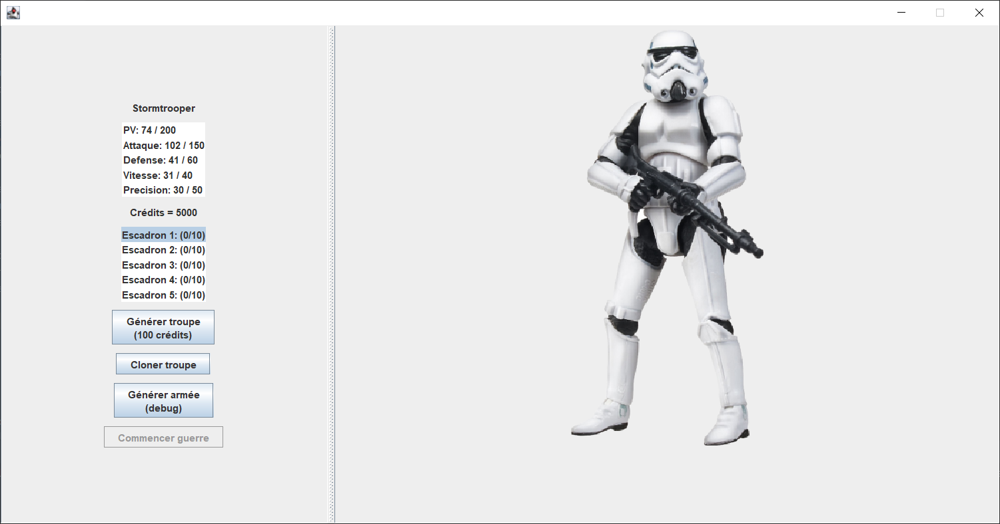
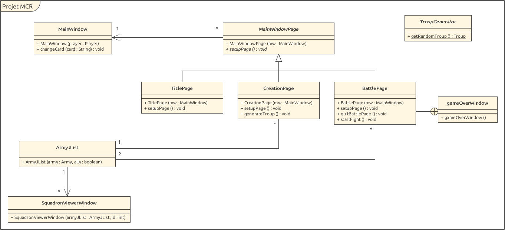

# Projet MCR : Prototype
## Star Wars Clone Clash

### Auteurs : Marzullo Loris, Dos Santos Joel, Seem Thibault

## Description de l'application

L'application est réalisée uniquement en Java, l'affichage est géré avec Swing.

Le projet consiste en un petit jeu de "stratégie" dans l'unviers Star Wars. Le principe est de générer des troupes et de les cloner afin de composer une armée. Celle-ci sera ensuite utilisée pour affronter d'autres armées.

Cependant, les troupes ne sont pas parfaites et sont générées avec des stats aléatoires, souvent pas optimales. De plus, lors d'un clonage, la troupe de base ET la nouvelle troupe peuvent perdre des points dans chacune de leurs stats.

Le but du jeu est ainsi de réaliser une armée avec les meilleures troupes possibles, en trouvant un équilibre entre les ressources utilisées pour générer de nouvelles troupes et la contrainte des stats qui descendent petit à petit.

Cette phase de jeu est la plus importante car les combats sont simulés, c'est-à-dire que les troupes vont attaquer automatiquement sans que le joueur puisse agir, jusqu'à ce qu'un gagnant soit désigné.

## Télécharger et utiliser le projet

- Cloner la branche main de [ce repository](https://github.com/MasterZeus97/MCR_Project) dans en local.
- Ouvrir le projet maven à l'aide du pom.xml dans l'IDE souhaité (Testé uniquement avec Intellij)
- Importer les dépendances du projet à l'aide de la commande : mvn clean install
- Le projet a été développé avec le SDK 17
- Le projet peut maintenant être lancé depuis l'IDE. La méthode main se trouve dans la classe Main, qui se trouve ici : src/main/java/Main

## Règles du jeu

Lors de l'ouverture de l'application, un écran titre s'affiche. En cliquant sur le bouton "Jouer", on accède à la fenêtre principale du jeu, où l'on peut créer une armée. Le joueur peut faire plusieurs choses depuis cette interface:



- Une troupe aléatoire est déjà générée. Son nom et ses statistiques sont affichées en haut à gauche. Les statistiques sont aléatoires et sont affichées sous la forme stat générée / stat max. Les stats sont les suivantes :

  - PV (point de vie): Lorsque ceux-ci tombent à 0, la troupe est détruite.

  - Attaque et défense: Permettent de calculer les dégâts infligés via la formule ```ATK - DEF```

  - Vitesse: Détermine l'ordre dans lequel les troupes attaquent. Plus la vitesse est grande, plus ils attaqueront tôt.

  - Précision: Stat unique aux Stormtroopers, détermine le taux de réussite de toucher un ennemi lors d'une attaque.

- Voir le nombre de crédits disponibles. Les crédits servent à générer de nouvelles troupes et sont gagnés à la fin d'un combat pour chaque troupe ennemie détruite.

- Voir les escadrons qui composent l'armée. Une armée a 5 escadrons pouvant contenir 10 troupes chacun. Lorsqu'une troupe est ajoutée à un escadron, elle le sera dans celui qui est sélectionné dans la liste.

  - Pour voir le détail d'un escadron il suffit de double-cliquer dessus. Une nouvelle fenêtre s'ouvre et il est alors possible de vider ou de cloner l'escadron.

- Le bouton "générer troupe" permet de générer une nouvelle troupe aléatoirement, avec des statistiques aléatoires également. Les troupes possibles sont les suivantes:

  - Stormtrooper: Troupe basique, qui a en plus une stat de précision

  - Scoot Trooper: Troupe relativement faible mais très rapide, agit généralement en premier.

  - Dark Trooper: Troupe avec énormément d'attaque, mais très peu de PV et de défense, ce qui la rend très fragile.

  - Death Trooper: Troupe avec énormément de PV et de défense, mais assez peu d'attaque et une vitesse extrêmement faible. Agira normalement en dernier.

  - Droid: Un droid générique, une troupe basique légèrement meilleur qu'un Stormtrooper, et qui n'a pas de stat de précision

  - KX Droid: Un Droid amélioré, mais un peu plus lent.

  - C3PO: Troupe très rare. Enormément de PV mais toutes ses autres stats sont au minimum. Permet de gagner beaucoup de crédits.

  - Dark Vador: Troupe très rare et la plus puissante.

- Le bouton "cloner troupe" ajoute la troupe actuelle dans l'escadron sélectionné. Cette action va cependant réduire les stats de la troupe clonée, ainsi que celles de la troupe prototype.

- Le bouton "Générer armée" est un bouton qui sert au test et au debug qui va générer aléatoirement une armée complète. Aucun crédit n'est dépensé en utilisant ce bouton.

- Le bouton "Commencer guerre" permet de valider l'armée actuelle et d'entrer dans la phase de combat du jeu.

## Implémentation

### Modèle Prototype


Semblable à l'interface Clonable de Java, l'interface Prototypeable permet d'implémenter le modèle prototype. Cela se fait en définissant la méthode ```copy()```, qui doit retourner une copie de l'objet.

Les 3 classes implémentant Prototypeable sont Troup, Squadron et Stat.

- La classe stat représente une statistique. Dans notre projet, une statistique est forcément liée à une troupe, mais elle pourrait être liée à une arme par exemple. 

  - Chaque statistique est caractérisée par :
    - Un String contenant son nom 
    - Un entier contenant la valeur de la statistique
    - Un entier pour la valeur maximum de cette stat 
    - Un entier pour la valeur minimum de cette stat 
    - Un entier représentant de combien la stat peut diminuer lorsque que la méthode downgradeValue() est appelée

  La méthode ```copy()``` définie par l'interface Prototypeable crée simplement un nouvel objet Stat en appelant le constructeur de copie privé de la classe Stat. Ce constructeur effectue une copie des attributs présenté juste avant dans le nouvel objet Stat.

- La classe Troup est une classe abstraite représentant une troupe pouvant faire partie de l'armée. Chaque troupe héritant de la classe Troup peut posséder des Stat différentes, qui sont stockée dans une map, mais il y a 4 Stat et 3 attributs qui sont nécessaire et dont les valeurs doivent être définies, quelle que soit la classe:

  - Les PV
  - L'attaque
  - La défense
  - La vitesse
  - La récompense minimum obtenue après défaite de la troupe
  - La récompense maximum obtenue après défaite de la troupe
  - Le pourcent de réduction des stats de cette troupe, c'est à dire de combien les Stat de cette troupe peuvent diminuer au maximum lors d'un appel à ```copy()```.

  La méthode ```copy()``` définie par l'interface Prototypeable n'est pas redéfinie dans cette classe. Chaque sous-classe est libre de réimplémenter cette méthode comme bon lui semble. Il n'est d'ailleurs pas possible d'implémenter cette méthode dans la classe Troup, car il faut créer un nouvel objet du type de la classe enfant appelante. L'implémentation utilisée dans les enfant implémentés actuellement (sauf C3PO) est la suivante :

  - On crée une nouvelle troupe en faisant appel au constructeur de copie de l'enfant, qui fait lui-même appel au constructeur de copie de Troup. Ce dernier copie le nom, les PV maximum, et les récompense min et max de la troupe copiée. Le constructeur de copie de Troup va aussi copier les statistiques de la troupe copiée en appelant la méthode ```copy()``` sur chacune des Stat présentent dans la troupe copiée.
  - On appel ensuite la méthode ```downgradeStat(downgradeStatChance)``` sur la troupe nouvellement créée afin de diminuer ses statistiques, avec comme chance de succes downgradeStatChance.

- La classe Squadron est un regroupement de 10 objets Troup. La méthode ```copy()``` définie par l'interface Prototypeable est implémentée ici en créant un nouveau squadron vide, et en le remplissant en appelant la méthode ```copy()``` sur chaque objet Troup présent dans le Squadron copié.

### Combats

Les combats sont gérés par la classe ```Combat```, qui prend en argument 2 armées et permet d'appeler la méthode ```startFight()``` afin de faire le déroulé d'un combat entier.

L'armée ennemie est générée aléatoirement parmi toutes les troupes existantes.

Les troupes sont triées dans l'ordre de leur vitesse et attaquent chacun leur tour. Durant ce tour, elles vont cibler une troupe ennemie au hasard et l'attaquer, puis passer à la troupe suivante, et ainsi de suite. Lorsqu'une troupe est détruite, elle est retirée de l'escadron, et lorsqu'un escadron est vide, il est remplacé par le suivant. Lorsqu'il n'y a plus d'escadron avec des troupes, l'armée est vidée et le combat se termine.

Dans le cas où le joueur gagné (donc l'armée ennemie est vide), il peut choisir de continuer à combattre contre une nouvelle armée ennemie, mais en utilisant que les troupes qui ont survécu au combat précédent. Il peut toujours vider et cloner ses escadons.

Dans tous les cas, le joueur gagnera une certaine somme de crédits en fonction des troupes ennemies détruites. Il aura également le log du combat détaillant les actions de chaque troupe.

### Affichage



Le diagramme de classe de la partie affichage est volontairement incomplet afin d'en faciliter la lecture en retirant certaines méthodes basiques (getters, setters, méthodes pour mettre à jour l'affichage, etc.).

La classe ```MainWindow``` hérite de ```JFrame``` et gère la fenêtre principale du jeu. Celle-ci est divisée en 3 pages: ```TitlePage```, ```CreationPage``` et ```BattlePage```, qui sont toutes des sous-classes de ```JPanel```. Ces pages sont utilisées dans un ```CardLayout``` à l'intérieur de la classe ```MainWindow``` afin de pouvoir naviguer de l'une à l'autre sans changer de fenêtre. Cela se fait avec un appel à ```changeCard()```, en spécifiant le nom de la nouvelle page.

Les différentes pages sont des classes distinctent et héritent de la classe abstraite ```MainWindowPage``` qui généralise leur constructeur et met à disposition la méthode ```setupPage()```. Comme son nom l'indique, cette méthode permet de (ré)initaliser la page et est appelée à chaque fois que l'on souhaite l'afficher, suite à un appel à ```changeCard()```. Les pages gèrent également les actions de leur boutons et mettent à jour leur affichage avec des méthodes.

La classe ```CreationPage``` possède une méthode ```generateTroup()``` qui est appelée avec le bouton "générer troupe" de l'interface graphique. Cette méthode fait un appel à la méthode statique ```getRandomTroup()``` de la classe abstraite ```TroupGenerator```, qui retourne une nouvelle troupe aléatoirement parmi une liste.

La classe ```BattlePage``` possède une méthode ```quitBattlePage()``` qui permet de quitter cette page proprement (elle va typiquement suppimer l'armée du joueur, puisque le combat est terminé). La méthode ```startFight()``` permet de lancer et simuler un combat, ainsi qu'afficher la fenêtre de game over avec les logs. Il s'agit de la classe ```gameOverWindow``` qui est déclarée dans la classe ```BattlePage```.

Enfin, la classe ```ArmyJList``` hérite de ```JList``` et la spécialise pour afficher les escadrons d'une armée. Cette classe a été ajoutée car les escadrons sont affichés dans la page de création de troupes et dans la page de combat (où il y a l'armée allié et l'armée ennemie).

Double-cliquer sur un élément de l'```ArmyJList``` ouvre une nouvelle fenêtre avec le détail de chaque troupe, cet affichage est géré par la classe ```SquadronViewerWindow```, qui hérite d'un ```JFrame```.

A noter que l'affichage est fonctionnel, mais un peu bancal. Plusieurs améliorations auraient pu être réalisées pour mettre le code au propre, notamment en utilisant les patterns Singleton (pour éviter d'ouvrir une fenêtre plusieurs fois) et Observer (pour mettre à jour les affichages sans passer par des méthodes "update()" spécifiques). Ces changements n'ont pas été faits par manque de temps... 
